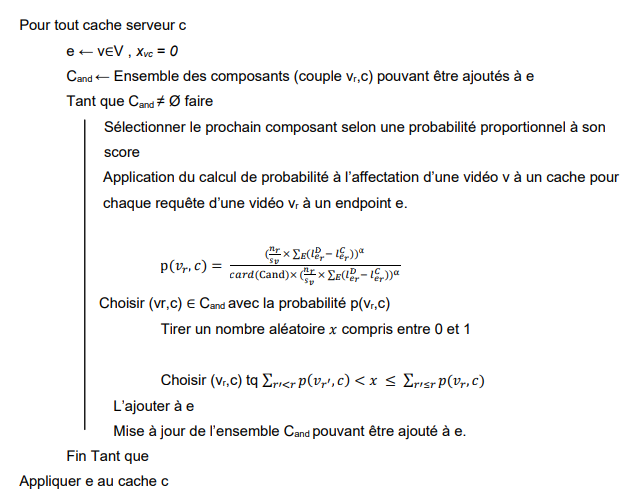
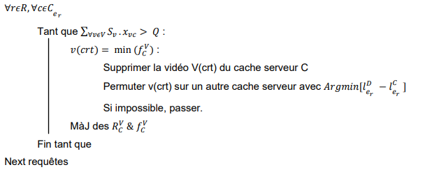
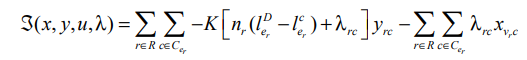

# :floppy_disk: Qualification Hashcode2017 : [Sujet](https://www.i3s.unice.fr/~garciar/teaching/hashcode2017prep/hashcode2017_qualification_task.pdf) :floppy_disk:

## Introduction

Nous avons avons transposés ce problème à des instances de **knapsack** (prblm du sac à dos). Ce problème se prête assez bien à des stratégies à trajectoire en aménageant préalablement l'objectif sous-jacent. Les approches extérieures (duales) n'assurent pas à chaque étape la **réalisabilité primale**, elles sont donc plus efficaces.

L'implémentation d'une **Scatter Search** (Population-Based Method) a nécessité l'implémentation d'une **GRASP** et d'une **Recherche locale**.

## GRASP

{width="490"}

## Recherche Locale

{width="450"}

## Borne supérieur Lagrangienne

{width="451"}

## Analyse Solution

On vérifie le respect des **5 contraintes** de notre problème. En effet, une solution qui surcharge les caches serveurs n'est pas applicable.

Puis, on calcul le *score* selon la méthode fourni par l'énoncé : on pondère par le nombre de requêtes.

**Tableau des scores**

| (méta)Heuristique                         | me_at_the_zoo | trending_today | videos_worth_spreading |
|-------------------------|----------------|----------------|----------------|
| Borne Inférieur                           | 0             | 0              | 0                      |
| Gloutonne                                 | 500000        | 500000         | 500000                 |
| GRASP                                     | 500000        | 500000         | 500000                 |
| Gloutonne + Recherche Locale              | 500000        | 500000         | 500000                 |
| GRASP + Recherche Locale                  | 500000        | 500000         | 500000                 |
| GRASP + Scatter Search                    | 500000        | 500000         | 500000                 |
| GRASP + Scatter Search + Recherche Locale | 500000        | 500000         | 500000                 |
| Borne Supérieur                           | 561 356       | 500 000        | 817 516                |

## Structure Programme

### Données

`donnees_modeles.py` DataClass des données d'entrées

`lecture_ecriture_fichiers.py` Lecture et Ecriture des fichiers d'entrée et de sortie

### Heuristiques

`heuristiques.py & meta_heuristiques.py` Production d'une solution à partir des données lus

### Contraintes

`contraintes.py` Vérification de la validité de la solution produite par l'heuristique

### Évaluation des résultats

`fonction_objective.py` Application de la fonction objective à maximiser

### Exécution

`main.py` Lancement de l'application & Configuration
